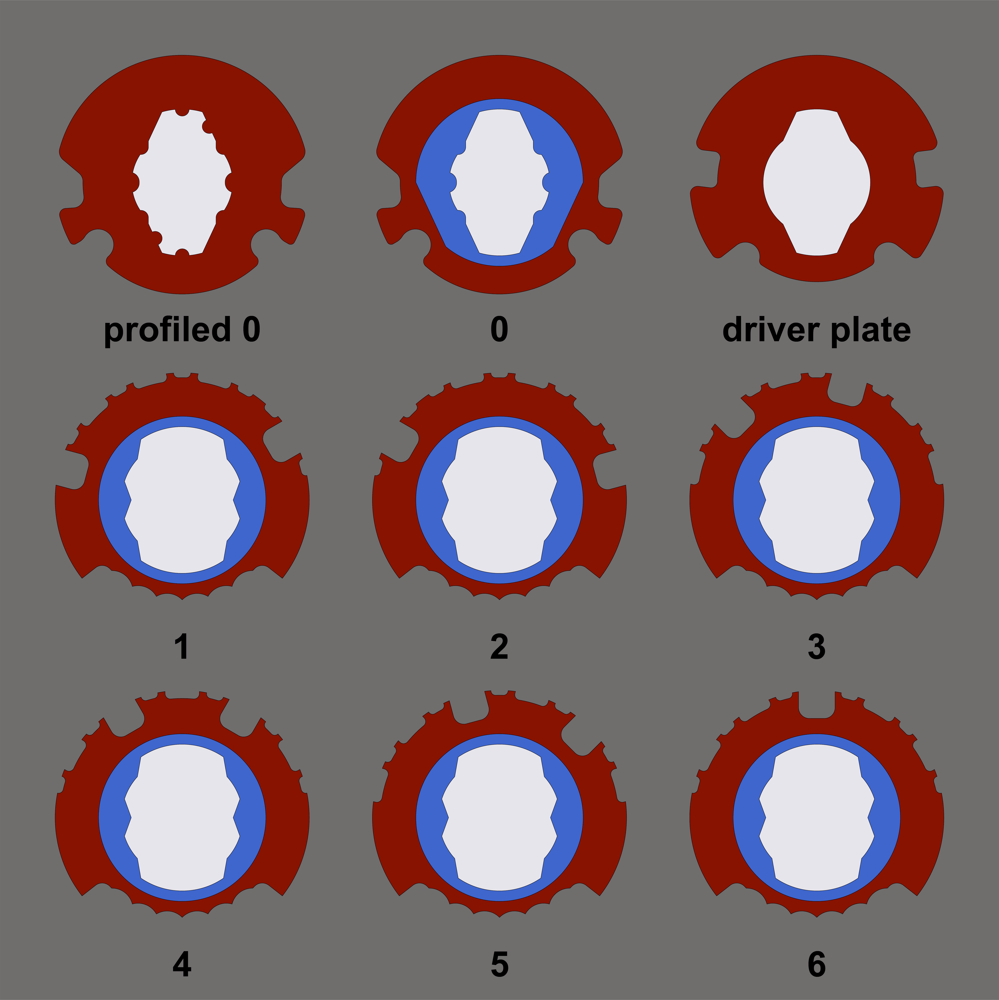

# Abloy decoding - January 2024

## Overview
This project, made by Clefmentine in January 2024, involves visually decoding a key and requesting the factory to create a new one by providing the correct number for the property card.

## How it Works
1. **Determine Key Model:**
   - Identify the key model among the following options:
     - protect
     - protect2
     - dislock
     - dislock Pro
     - more abloy in general
     

2. **Decode the key:**
    - Protect / protect 2
        
        decoding charts made by Reinder Stegen
        
        
    - Dislock / Dislock
        
    - Other not yet documented
   

3. **Get code using the python script:**
    
    first disc is always 0 so only start putting the decoded discs from the second one (10 numbers in total)
    ```PYTHON
    if __name__ == "__main__":
        # Example cut input
        cut_input = [2, 3, 6, 3, 1, 2, 0, 2, 1, 3]
        # code_input = [7, 4, 6, 4, 6, 3, 6, 1, 0, 7]
        print(translate_cut_to_code(cut_input, translation_table))
    ```

## Usage
I am not responsible for bad usage of this code, I shared it to prove a security flow in Abloy key copy system
